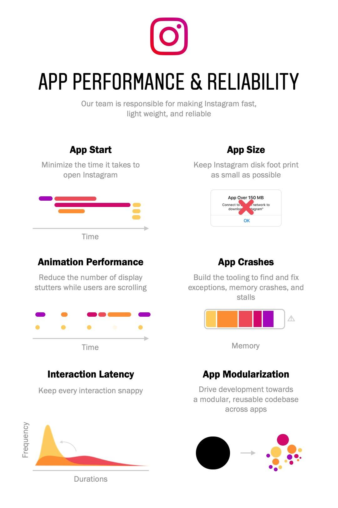

#### CrashBot

I migrated a crash tool from Facebook and made it work for Instagram. The tool would alert our team if Instagram
crashes suddenly spiked. The tool analyzed crash reports to determine the root cause and would also alert whoever
owned that piece of code.

#### Experiment Regression Checker

Instagram has hundreds of different experiments running at any given time. We had an existing tool that could 
alert experiment owners when their experiments were regressing a core metric. I added crash support for this
tool so that any developer was quickly alerted when one of their experiments was causing a spike in crashes.

Our team worked on the following areas:

