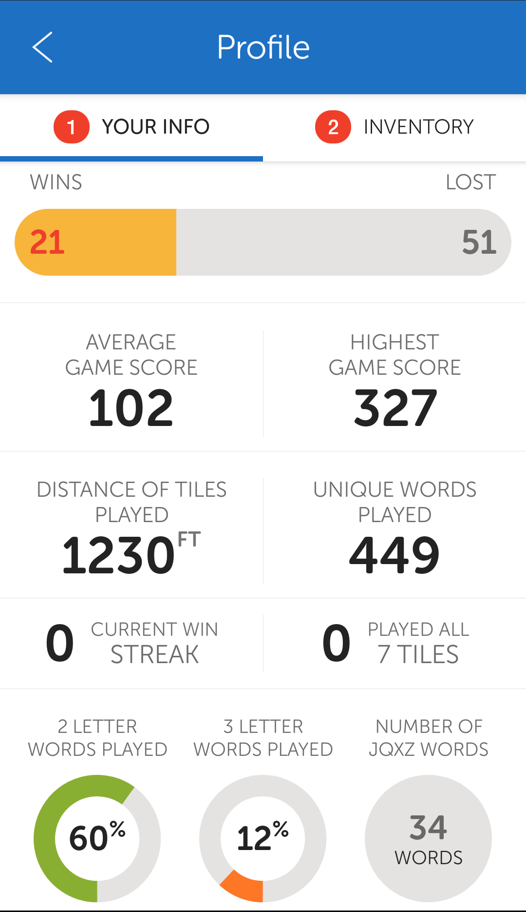
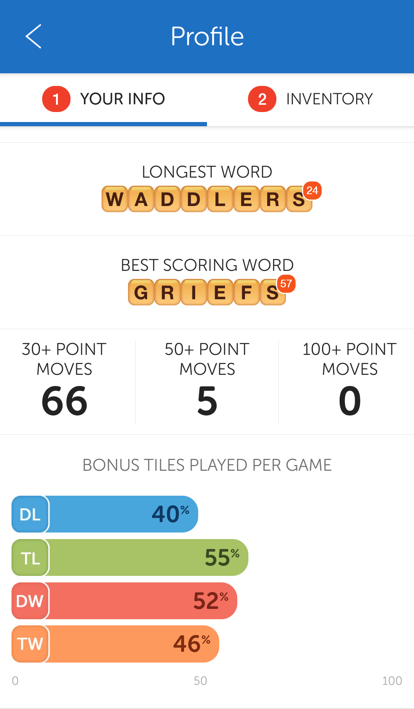
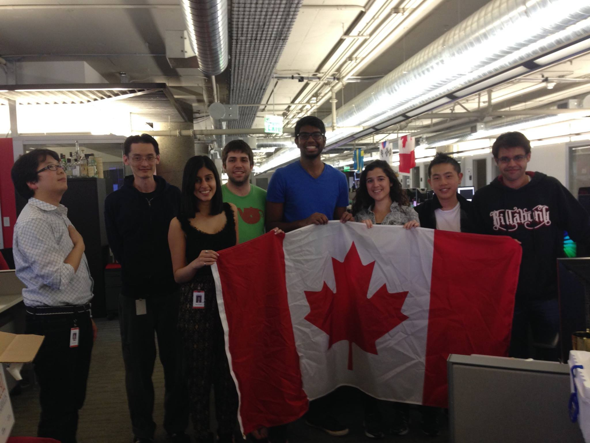
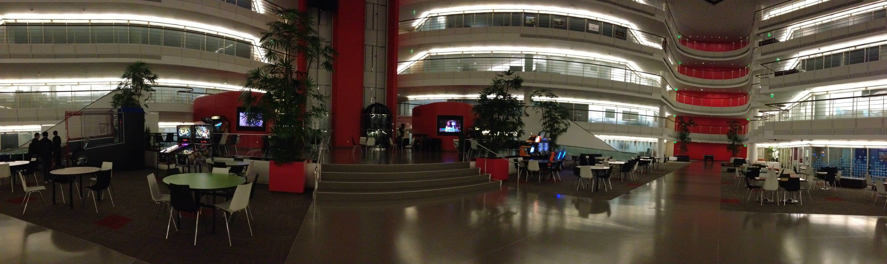

I loved my time at Zynga. It was my first experience in Silicon Valley. The Words With Friends team was filled amazing people
and talented engineers. I was lucky to be around them and get to soak up so much knowledge. The engineers were always 
trying to teach me how to become better. 

I built the player profile feature. Users could view their own profile, or search up a friend and see their profile.
Profiles contained weekly, monthly, and all-time stats. I built several custom views to populate the profile screen.
The custom views included bar, line, and profile charts. The most challenging part of this feature was getting animations
to work perfectly. Animations in Android have come a long way, and they used to be much harder to get right.

| | |
|---|----|

I am so appreciative of the Words With Friends team. They took me under their wing and taught me Android development from the
ground up. I got to experience what it was like to launch a game. There were a lot of late nights leading up the launch, and
we'd always end the late nights with a few rounds of Super Smash Brothers. 

The Zynga HQ was made up of several floors. Each floor belonged to a different Zynga game. In the basement was a full arcade,
a basketball court, a yoga studio and free weights section. I spent a lot of my free time in the Zynga building. Every Monday, 
Wednesday and Friday I'd head to the gym during my lunch hour and workout with Derek and Albert the professional trainers. 
They offered free group workout classes. The trainers taught me so much about mobility and strength. They put me on the right 
track early on how to think about my body. I'd head to the cafeteria to grab a fast but well earned lunch before the talented 
culinary team wrapped up the lunch service. I'd feel so pumped to get back to work after a good workout. 

On Tuesdays and Thursdays, I'd still spend quite a bit of time in the gym. My fast-paced lunch hour workout was replaced with a 
much slower yoga session. After yoga and quick lunch, I'd head back up to my desk to get a few hours of coding in, before heading
back to the basement for a two hour pick-up basketball run. The basketball runs were a lot of fun to play but they were also great
for networking with other people in the company. I learned about a lot of different areas of the company on the court.

I met a lot of smart people who are still my friends today. I got to learn a lot of new things and play a lot of different games. 
I got to live in San Francisco and explore sunny California. I got to help launch a game to millions of users. Working at Zynga was an amazing experience. 
